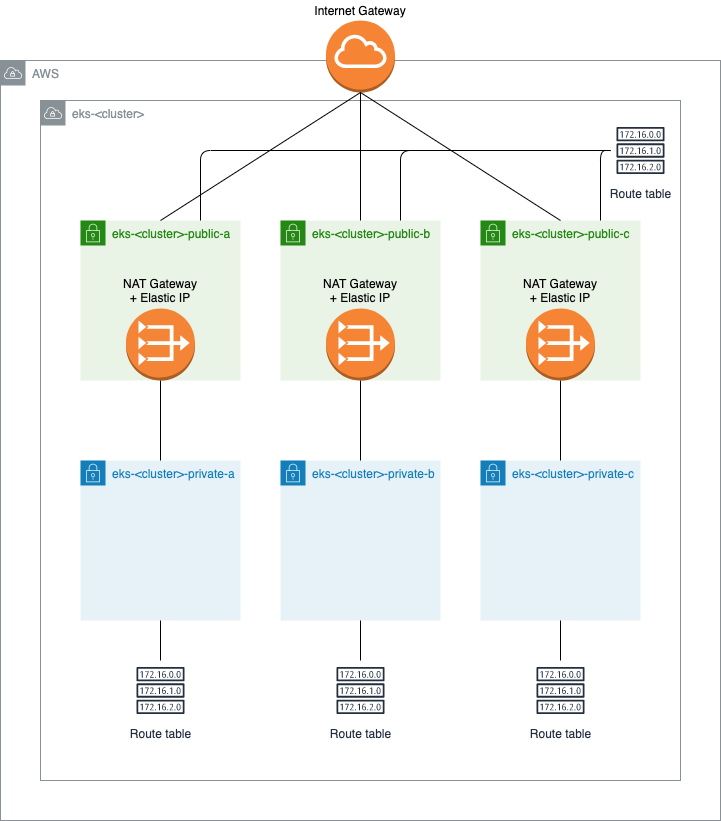

# Terraform for EKS cluster

Instead of using [terraform-aws-eks module](https://github.com/terraform-aws-modules/terraform-aws-eks), project uses
only terraform aws provider resources to avoid complexity and increase readability. Also, to make it easy to make
updates and changes.

Terraform is in [tf](tf) directory (`cd tf`):
 - initialize and validate
   - `terraform init`
   - `terraform validate`
   - `terraform plan`
 - apply `terraform apply`
 - destroy `tf destroy`

## AWS VPC

VPC name is `eks-<cluster>` (`<cluster>` defaults to `main` and can be changed with `cluster_name` variable). Default
VPC address is `10.0.0.0` (can be changed with `vpc_address` variable) and VPC netmask is `/24`.

### subnets

We create 3 public and 3 private subnets in different availability zones. Each public subnet has
[NAT Gateway](https://docs.aws.amazon.com/vpc/latest/userguide/vpc-nat-gateway.html) with elastic IP to be used by
private subnets for internet traffic.

| Name                      | Type    | AZ | CIDR          | Hosts | Address        | Broadcast     | Host Min      | Host Max      |
| ------------------------- | ------- | -- | ------------- | ----- | -------------- | ------------- | ------------- | ------------- |
| eks-\<cluster>-private-a  | private | a  | 10.0.0.0/26   | 62    | 10.0.0.0       | 10.0.0.63     | 10.0.0.1      | 10.0.0.62     |
| eks-\<cluster>-private-b  | private | b  | 10.0.0.64/26  | 62    | 10.0.0.64      | 10.0.0.127    | 10.0.0.65     | 10.0.0.126    |
| eks-\<cluster>-private-c  | private | c  | 10.0.0.128/26 | 62    | 10.0.0.128     | 10.0.0.191    | 10.0.0.129    | 10.0.0.190    |
| eks-\<cluster>-public-a   | public  | a  | 10.0.0.192/28 | 14    | 10.0.0.192     | 10.0.0.207    | 10.0.0.193    | 10.0.0.206    |
| eks-\<cluster>-public-b   | public  | b  | 10.0.0.208/28 | 14    | 10.0.0.208     | 10.0.0.223    | 10.0.0.209    | 10.0.0.222    |
| eks-\<cluster>-public-c   | public  | c  | 10.0.0.224/28 | 14    | 10.0.0.224     | 10.0.0.239    | 10.0.0.225    | 10.0.0.238    |

  

## AWS EKS cluster

Cluster name defaults to `main` (can be changed with `cluster_name` variable). Cluster has a public endpoint open to all 
traffic (`0.0.0.0/0`) by default, it is strongly encouraged to change this to list of allowed CIDRs using
`public_access_cidrs` variable: `terraform apply -var='public_access_cidrs=["<your-IP>/32"]'`

We prefix AWS IAM role for a cluster with region (so it doesn't clash if you have a cluster with the same name in
multiple regions). IAM role name is in `<region>-eks-<cluster>` format.

### Node groups

By default, we create one `default` node group with `t2.small` instances. Update [tf/variables.tf](tf/variables.tf) file
to change defaults. Node groups use launch template, so we have managed EKS nodes, but with custom images. To update
image, but let AWS roll the nodes, update launch template (e.g change instance type) and then set node groups launch
template version to the one you want to use.
